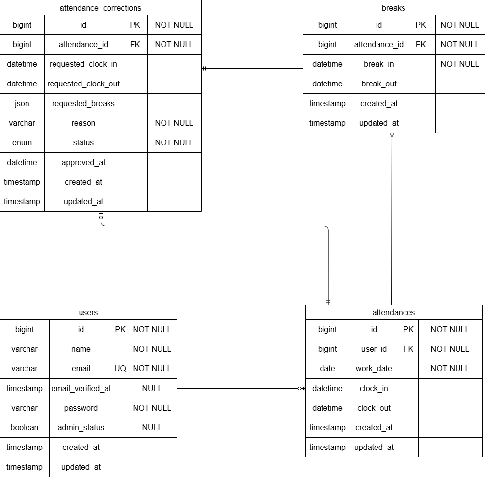

# アプリケーション名
coachtech-timekeeper

# 環境構築
Dockerビルド

1. git clone https://github.com/shinichi-ushioda/coachtech-timekeeper.git

2. docker-compose up -d --build

※MySQLは、OSによって起動しない場合があるのでそれぞれのPCに合わせてdocker-compose.ylmlファイルを編集してください。  
Laravel環境構築

1.docker-compose exec php bash  
2.composer install  
3.env.exampleファイルから.envを作成し、環境変数を変更  
4.php artisan key:generate  
5.php artisan migrate  
6.php artisan db:seed  
7.chmod -R 777 storage bootstrap/cache  

## 使用技術
・php 8.3.32  
・Laravel 13.16.1  
・MySQL 8.0

## URL
・開発環境：http://localhost:8080  
・phpMyAdmin:http://localhost:8081

※Makefileは実行するコマンドを省略することができる便利な設定ファイルです。コマンドの入力を効率的に行えるようになります。<br>

## メール認証
mailtrapというツールを使用しています。<br>
以下のリンクから会員登録をしてください。　<br>
https://mailtrap.io/

動作確認する際は、以下の項目を .env に設定してください。  
.envファイルのMAIL_MAILERからMAIL_ENCRYPTIONまでの項目をコピー＆ペーストしてください。　<br>
MAIL_MAILER=smtp  
MAIL_HOST=sandbox.smtp.mailtrap.io  
MAIL_PORT=2525  
MAIL_USERNAME=（あなたのMailtrapのユーザー名）  
MAIL_PASSWORD=（あなたのMailtrapのパスワード）  
MAIL_ENCRYPTION=null  
MAIL_FROM_ADDRESSは任意のメールアドレスを入力してください。
Mailtrap の InboxID は、Mailtrap の「Email Testing → Inboxes」から確認できます。　<br>

## テーブル仕様
### usersテーブル
| カラム名 | 型 | primary key | unique key | not null | foreign key |
| --- | --- | --- | --- | --- | --- |
| id | bigint | ◯ |  | ◯ |  |
| name | varchar(255) |  |  | ◯ |  |
| email | varchar(255) |  | ◯ | ◯ |  |
| email_verified_at | timestamp |  |  |  |  |
| password | varchar(255) |  |  | ◯ |  |
| admin_status | boolean |  |  |  |  |
| remember_token | varchar(100) |  |  |  |  |
| created_at | timestamp |  |  |  |  |
| updated_at | timestamp |  |  |  |  |

### attendancesテーブル
| カラム名 | 型 | primary key | unique key | not null | foreign key |
| --- | --- | --- | --- | --- | --- |
| id | bigint | ◯ |  | ◯ |  |
| user_id | bigint |  |  | ◯ | users(id) |
| work_date | date |  |  | ◯ |  |
| clock_in | datetime |  |  |  |  |
| clock_out | datetime |  |  |  |  |
| created_at | timestamp |  |  |  |  |
| updated_at | timestamp |  |  |  |  |

### breaksテーブル
| カラム名 | 型 | primary key | unique key | not null | foreign key |
| --- | --- | --- | --- | --- | --- |
| id | bigint | ◯ |  | ◯ |  |
| attendance_id | bigint |  |  | ◯ | attendances(id) |
| break_in | datetime |  |  | ◯ |  |
| break_out | datetime |  |  |  |  |
| created_at | timestamp |  |  |  |  |
| updated_at | timestamp |  |  |  |  |

### attendance_correctionsテーブル
| カラム名 | 型 | primary key | unique key | not null | foreign key |
| --- | --- | --- | --- | --- | --- |
| id | bigint | ◯ |  | ◯ |  |
| attendance_id | bigint |  |  | ◯ | attendances(id) |
| requested_clock_in | datetime |  |  |  |  |
| requested_clock_out | datetime |  |  |  |  |
| requested_breaks | json |  |  |  |  |
| status | enum |  |  | ◯ |  |
| reason | varchar(255) |  |  | ◯ |  |
| approved_at | datetime |  |  |  |  |
| created_at | timestamp |  |  |  |  |
| updated_at | timestamp |  |  |  |  |


## ER図


## テストアカウント
name: ユーザー１（一般）  
email: user1@example.com  
password: password 
メール認証済 
-------------------------
name: ユーザー２（一般）  
email: user2@example.com  
password: password  
メール認証済
-------------------------
name: ユーザー３（管理者）  
email: user3@example.com  
password: password  
メール認証済(admin_status= true)  

## PHPUnitを利用したテストに関して
以下のコマンド:  
```
//テスト用データベースの作成
docker-compose exec mysql bash
mysql -u root -p
//パスワードはrootと入力
create database test_database;## PHPUnitを利用したテストに関して

本プロジェクトのテストは、SQLiteのインメモリデータベースを使用します。
`phpunit.xml` にて `DB_CONNECTION=sqlite` / `DB_DATABASE=:memory:` を設定しているため、
テスト用データベースを別途作成する必要はありません。

以下のコマンドでテストを実行できます。

docker-compose exec php bash
php artisan test

特定のテストのみ実行する場合:  
php artisan test --filter=RegisterTest

```

## 補足：要件シートとの対応

要件シートに記載のクラス名と、本プロジェクトの実装クラス名が一部異なります。役割は同一です。

| 要件シートの記載 | 本プロジェクトの実装 | 役割 |
| --- | --- | --- |
| AttendanceRecordController | WorkRecordController | 一般ユーザーの勤怠一覧・詳細・修正申請 |

N+1対策（Eager Loading）は、以下の該当箇所すべてで `with()` を使用して実装しています。

- 一般ユーザーの勤怠一覧：`WorkRecordController@list`
- 管理者の勤怠一覧：`AdminAttendanceController@index` / `staff`
- マイ勤怠レポート集計：`AttendanceReportService@build`

## 勤怠修正に関する仕様（当日・未来日の制限）

当日を含む未来の日付の勤怠は、修正・修正申請ができない仕様としています。

- 一般ユーザー：当日を含む未来の日付に対して、勤怠の修正申請ができません。
- 管理者：当日を含む未来の日付に対して、勤怠の直接修正ができません。

上記の日付で修正・申請を行おうとした場合は、処理は実行されず、画面にエラーメッセージが表示されます。

なお、ダミーデータ（シーダー）は当日を含む未来の日付の勤怠を生成できるようにしています。

## 公開API

外部アプリケーションから勤怠データを取得・操作できる REST API を提供しています。

### ベースURL
http://localhost:8080/api/v1  

### 認証について

読み取り系（GET）は認証不要です。書き込み系（POST / PUT / DELETE）は Laravel Sanctum によるトークン認証が必要です。

認証が必要なエンドポイントを呼び出す際は、リクエストヘッダーに発行済みのトークンを付与してください。  
Authorization: Bearer {発行したトークン}  
Accept: application/json  
トークンは以下の方法で発行できます（tinker を使用）。

```bash
php artisan tinker
>>> App\Models\User::find(1)->createToken('token-name')->plainTextToken;
```

### エンドポイント一覧

| メソッド | エンドポイント | 説明 | 認証 |
| --- | --- | --- | --- |
| GET | /attendance-records | 勤怠一覧を取得 | 不要 |
| GET | /attendance-records/{attendanceRecord} | 勤怠詳細を取得 | 不要 |
| POST | /attendance-records | 勤怠を新規登録 | 必要 |
| PUT | /attendance-records/{attendanceRecord} | 勤怠を更新 | 必要 |
| DELETE | /attendance-records/{attendanceRecord} | 勤怠を削除 | 必要 |

### 一覧取得のクエリパラメータ（GET /attendance-records）

| パラメータ | 説明 | 例 |
| --- | --- | --- |
| user_id | 特定ユーザーの勤怠に絞り込み | ?user_id=1 |
| date | 特定日の勤怠に絞り込み | ?date=2026-07-01 |
| month | 特定月の勤怠に絞り込み | ?month=2026-07 |
| per_page | 1ページあたりの件数（デフォルト20、最大100） | ?per_page=50 |
| page | ページ番号 | ?page=2 |

### リクエストボディ（POST / PUT）

```json
{
    "date": "2026-07-01",
    "clock_in": "09:00:00",
    "clock_out": "18:00:00",
    "comment": "備考"
}
```

※ `user_id` はリクエストで指定しません。認証済みユーザーから自動的に付与されます。

### レスポンス例

一覧取得（GET /attendance-records）

```json
{
    "data": [
        {
            "id": 1,
            "user_id": 1,
            "user": {
                "id": 1,
                "name": "ユーザー1"
            },
            "date": "2026-07-01",
            "clock_in": "09:00:00",
            "clock_out": "18:00:00",
            "total_time": "08:00",
            "total_break_time": "01:00",
            "comment": null,
            "breaks": [
                {
                    "id": 1,
                    "break_in": "12:00:00",
                    "break_out": "13:00:00"
                }
            ],
            "applications": []
        }
    ],
    "links": [],
    "meta": {
        "current_page": 1,
        "from": 1,
        "last_page": 5,
        "per_page": 20,
        "to": 20,
        "total": 92
    }
}
```

### 主なレスポンスステータス

| ステータス | 意味 |
| --- | --- |
| 200 | 取得・更新の成功 |
| 201 | 新規登録の成功 |
| 204 | 削除の成功 |
| 401 | 未認証（トークンが無い・不正） |
| 403 | 他ユーザーの勤怠を操作しようとした |
| 404 | 対象の勤怠が存在しない |
| 422 | バリデーションエラー |  

### 備考
URLは要件どおり attendance-records だが、内部のテーブルは attendances を使用しています。

## 公開APIのレスポンス仕様に関する補足

### レスポンスのフィールド構成について

要件シートには、APIレスポンスに関して2種類の記述があります。

1. 「API Resource の構造」の表では、一覧API（index）と詳細API（show）で同一の `AttendanceRecordResource` を共用し、`whenLoaded()` によって `user` / `breaks` / `applications` のみを出し分ける、とされています。
2. 一方、AP01（一覧）とAP02（詳細）のレスポンスボディ例では、一覧と詳細で一部のフィールド構成が異なって記載されています。

本実装では、前者の「同一Resourceを共用し、whenLoadedで関連データのみ出し分ける」という設計方針を採用しています。そのため、`user_id` / `total_time` / `total_break_time` などの関連データ以外のフィールドは、一覧・詳細のどちらのレスポンスにも共通して含まれます。

これは、Resourceを一元管理して保守性を高める意図によるものです。`whenLoaded()` で出し分けているのは、要件シートの「API Resource の構造」で指定されたとおり、`user` / `breaks` / `applications` の関連データのみです。

### 一覧APIのbreaksについて

一覧API（GET /api/v1/attendance-records）のレスポンスにも `breaks`（休憩明細）を含めています。これは、`total_break_time` の算出に必要な休憩データを N+1問題を防ぐために Eager Loading（`with('breaks')`）しており、読み込んだデータが `whenLoaded('breaks')` によってレスポンスに含まれるためです。

### applicationsの項目について

`applications`（修正申請）の各項目の詳細仕様は要件シートに明記がないため、修正申請の主要な項目（`id` / `requested_clock_in` / `requested_clock_out` / `reason` / `status`）を、他フィールドと同様の形式（時刻は HH:MM:SS 形式）に整形して返す実装としています。